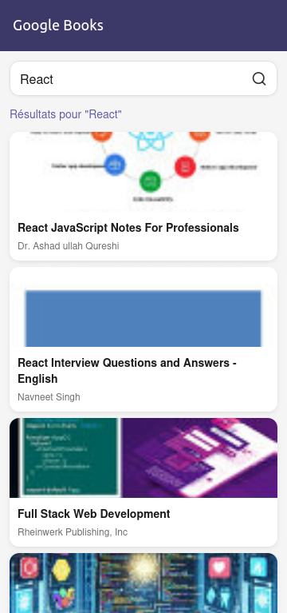

# Bienvenue

Ce projet est une petite illustration de l'utilisation de [Google books api](https://www.googleapis.com/books/v1/volumes?q=react)

## Set up

```
git clone https://github.com/Mifalia/google-books-expo.git
```

```
cd google-books-expo
```

```
npm ci
```

## Captures d'écran


